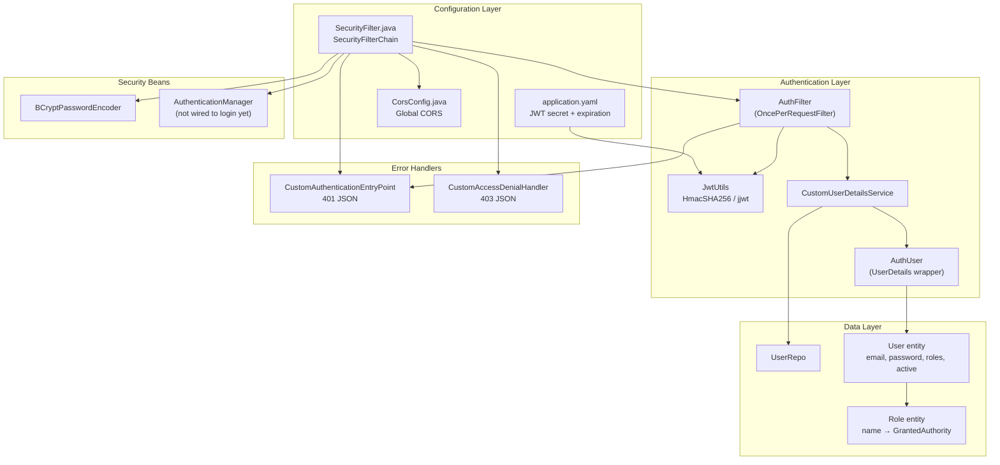
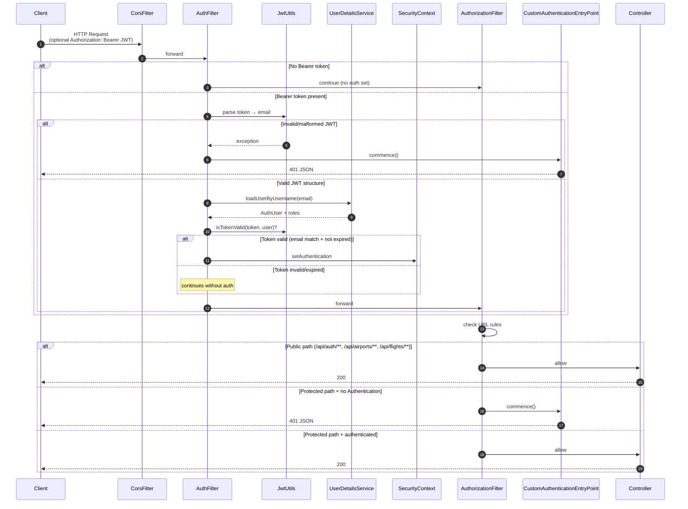
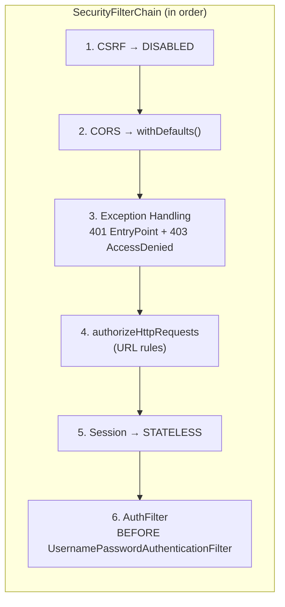
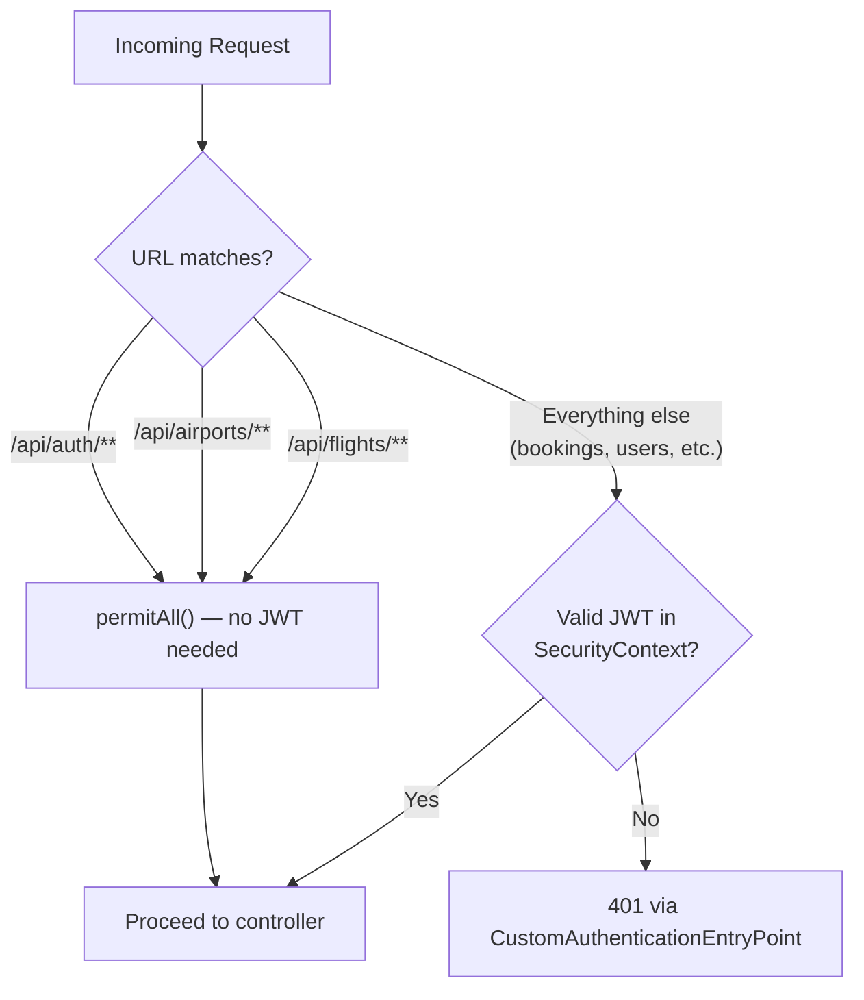
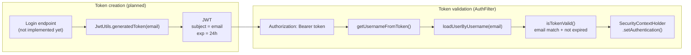
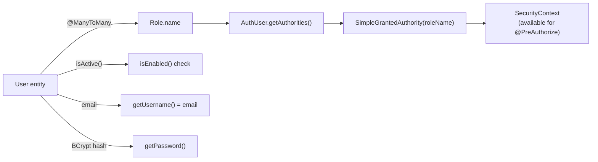
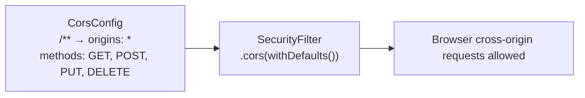

# HRAirline Backend

Spring Boot REST API for the HR Airline booking application.

## Security Configuration

HRAirline uses **stateless JWT Bearer authentication** with Spring Security. There is no server-side session; each request is validated through a custom `AuthFilter`.

### Security Components

| Component | File | Role |
|-----------|------|------|
| Main security config | `security/SecurityFilter.java` | `SecurityFilterChain`, CSRF, CORS, URL rules, session policy |
| JWT filter | `security/AuthFilter.java` | Reads `Authorization: Bearer <token>`, validates JWT, sets `SecurityContext` |
| JWT utility | `security/JwtUtils.java` | Sign, parse, and validate tokens (jjwt 0.12.6) |
| User loading | `security/CustomUserDetailsService.java` | `UserDetailsService` lookup by email |
| Principal | `security/AuthUser.java` | `UserDetails` wrapper around the `User` entity |
| CORS | `security/CorsConfig.java` | Global MVC CORS mappings |
| 401 handler | `exceptions/CustomAuthenticationEntryPoint.java` | JSON response for unauthenticated requests |
| 403 handler | `exceptions/CustomAccessDenialHandler.java` | JSON response for forbidden requests |



### Request Flow



### Filter Chain

Configured in `SecurityFilter.java`:



| Setting | Value |
|---------|-------|
| CSRF | Disabled (stateless JWT API) |
| Session | `STATELESS` — no server-side session |
| Custom filter | `AuthFilter` runs before `UsernamePasswordAuthenticationFilter` |
| Method security | `@EnableMethodSecurity` enabled (no `@PreAuthorize` usage yet) |

### URL Authorization Rules



| Path pattern | Access |
|--------------|--------|
| `/api/auth/**` | Public |
| `/api/airports/**` | Public |
| `/api/flights/**` | Public |
| All other paths | Authenticated (valid JWT required) |

### JWT Configuration

JWT settings live in `src/main/resources/application.yaml`:

```yaml
app:
  jwt:
    secret-key: ${JWT_SECRET:<dev-fallback-key>}
    expiration-ms: 86400000  # 24 hours
```

| Setting | Value |
|---------|-------|
| Algorithm | HmacSHA256 |
| Subject | User email |
| Expiration | 24 hours (`86400000` ms) |
| Secret | `JWT_SECRET` environment variable (dev fallback in YAML) |
| Header format | `Authorization: Bearer <token>` |



### Roles and Identity



- Roles are mapped as `SimpleGrantedAuthority(role.getName())` with **no automatic `ROLE_` prefix**.
- `AuthUser.isEnabled()` returns `user.isActive()`.
- `BCryptPasswordEncoder` is registered as a bean; login/register endpoints are not implemented yet.

### CORS Policy



| Setting | Value |
|---------|-------|
| Paths | `/**` |
| Origins | `*` (all) |
| Methods | GET, POST, PUT, DELETE |

### Environment Variables

| Variable | Purpose |
|----------|---------|
| `JWT_SECRET` | Overrides the default JWT signing key (required in production) |
| `EMAIL_PASSWORD` | SMTP password for email notifications |

### Implementation Status

| Ready | Not yet implemented |
|-------|---------------------|
| JWT validation filter | Login / register REST endpoints |
| URL-based auth rules | OAuth (Google/Facebook — data model only) |
| BCrypt password encoder bean | `AuthenticationManager` used for login |
| Role loading from DB | Method-level `@PreAuthorize` |
| 401/403 JSON error handlers | REST controllers (security rules are ahead of API surface) |

### Security File Index

```
src/main/java/com/hr/airline/
├── security/
│   ├── SecurityFilter.java      # SecurityFilterChain configuration
│   ├── AuthFilter.java          # JWT Bearer filter
│   ├── JwtUtils.java            # Token sign/parse/validate
│   ├── CorsConfig.java          # Global CORS
│   ├── CustomUserDetailsService.java
│   └── AuthUser.java
├── exceptions/
│   ├── CustomAuthenticationEntryPoint.java
│   └── CustomAccessDenialHandler.java
└── entities/
    ├── User.java
    └── Role.java
```
